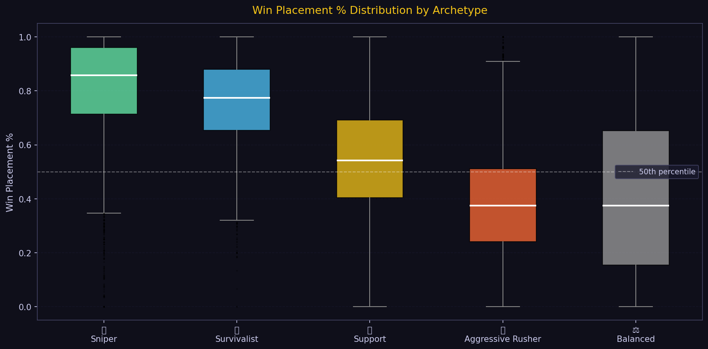

# PUBG Win Placement Prediction


A machine learning project that predicts how well a PUBG player will finish in a match, built end-to-end by **Nitya Thaker** — from raw data and feature engineering all the way to a deployed web app.

---

## Live Demo

[Try the Streamlit App](https://pubg-win-prediction.streamlit.app) — deploys in Week 3

---

## Results

| Day | What changed | MAE |
|-----|-------------|-----|
| 1 | Baseline model, 5 features | 0.10000 |
| 2 | Feature engineering, 50+ features | 0.05000 |
| 3 | Optuna hyperparameter tuning | 0.05297 |
| 4 | Cheater detection and new features | 0.05296 |
| 5 | SHAP feature surgery, 105 features | 0.05130 |

Final MAE of 0.0513 means the model predicts a player's finish percentile within about 5 points, trained on 4.4 million rows.

---

## Visualizations

<table>
<tr>
<td><br><sub>MAE improvement across 5 days</sub></td>
<td><br><sub>Top 20 features by SHAP value</sub></td>
</tr>
<tr>
<td><br><sub>Feature correlation with win placement</sub></td>
<td><br><sub>Win rates by player archetype</sub></td>
</tr>
</table>

---

## Feature Engineering

105 features were built from the original 29 columns, grouped into these categories:

| Category | Examples |
|----------|---------|
| Combat | damagePerKill, headshotRate, longRangeKillRate |
| Movement | totalDistance, walkRatio, survivalScore |
| Survival Proxy | survivalRatio, boostIntensity, killPlaceNorm |
| Resources | totalHealing, crateHunterScore, looting_efficiency |
| Team Aggregations | grp_kills_sum/mean/max, killShareInTeam |
| Match Normalization | killPercentileInMatch, damageVsMatchAvg |
| Log and Clipped | kills_log, damage_clipped, totalDistance_log |

The single strongest predictor turned out to be `walkDistance` — players who keep moving survive longer. Second was `killPlace`, your kill ranking within the match relative to everyone else.

---

## Player Archetype System

Every player gets classified into one of five archetypes based on their stats:

| Archetype | Win Rate | Style |
|-----------|----------|-------|
| Aggressive Rusher | 38.7% | High kills, dies early |
| Survivalist | 75.0% | Rotates constantly, avoids fights |
| Sniper | 81.1% | Long-range, high headshot rate |
| Support | 54.9% | Revives teammates, plays for the team |
| Balanced | 41.5% | Solid across all stats — 78% of players fall here |

---

## Project Structure

```
pubg-win-prediction/
├── notebooks/
│   ├── day1_baseline.ipynb
│   ├── day2_feature_engineering.ipynb
│   ├── day3_model_tuning.ipynb
│   ├── day4_cheater_detection.ipynb
│   ├── day5_shap_analysis.ipynb
│   └── day6_visualizations.ipynb
├── src/
│   ├── __init__.py
│   ├── features.py
│   ├── predict.py
│   └── scouting_report.py
├── models/
│   └── .gitkeep
├── assets/
├── requirements.txt
├── requirements-dev.txt
├── .gitignore
└── README.md
```

The model file `pubg_model_v5.pkl` is too large for GitHub. Download it from [Google Drive](#) and place it in the `models/` folder.

---

## Quickstart

```bash
git clone https://github.com/NityaThaker/pubg-win-prediction.git
cd pubg-win-prediction
pip install -r requirements.txt
```

Place `train_V2.csv` in `data/` and `pubg_model_v5.pkl` in `models/`, then:

```python
from src.predict import load_model, predict_single

model, feature_cols = load_model(
    "models/pubg_model_v5.pkl",
    "models/day5_feature_cols.pkl"
)

stats = {
    "kills": 5, "damageDealt": 420, "walkDistance": 2200,
    "boosts": 3, "heals": 4, "weaponsAcquired": 6,
    "killPlace": 8, "maxPlace": 94, "numGroups": 90,
    "matchType": "squad", "longestKill": 87,
    "headshotKills": 2, "assists": 1, "DBNOs": 1,
    "revives": 0, "rideDistance": 0, "swimDistance": 0,
    "roadKills": 0, "teamKills": 0, "vehicleDestroys": 0,
    "matchDuration": 1800, "rankPoints": 1500,
    "killPoints": 1000, "winPoints": 1500, "killStreaks": 2,
    "groupId": "g1", "matchId": "m1", "Id": "p1",
}

print(predict_single(stats, model, feature_cols))
```

---

## Running the Notebooks

The notebooks are meant to be run in order in Google Colab, with the dataset at `/content/drive/MyDrive/PUBG_Project/train_V2.csv`.

```
Day 1  →  notebooks/day1_baseline.ipynb
Day 2  →  notebooks/day2_feature_engineering.ipynb
Day 3  →  notebooks/day3_model_tuning.ipynb
Day 4  →  notebooks/day4_cheater_detection.ipynb
Day 5  →  notebooks/day5_shap_analysis.ipynb
Day 6  →  notebooks/day6_visualizations.ipynb
```

---

## Deployment

```bash
streamlit run app/streamlit_app.py
```

To deploy on Streamlit Cloud (free): push the repo to GitHub, connect it at share.streamlit.io, set the main file to `app/streamlit_app.py`, and add your model path as a secret.

---

## Tech Stack

| Layer | Tool |
|-------|------|
| Language | Python 3.10+ |
| ML | LightGBM 4.3 |
| Tuning | Optuna (TPE sampler, 100 trials) |
| Explainability | SHAP TreeExplainer |
| Data | pandas, numpy |
| Visualization | matplotlib, seaborn, plotly |
| API | FastAPI + uvicorn |
| Frontend | Streamlit |
| Hosting | Streamlit Cloud |

---

## Model Details

| Setting | Value |
|---------|-------|
| Algorithm | LightGBM |
| Features | 105 |
| Training rows | ~1.1M (25% sample, cheaters removed) |
| Cross-validation | 3-fold |
| learning_rate | 0.0307 |
| num_leaves | 188 |
| max_depth | 11 |
| Final MAE | 0.0513 |

---

## License

MIT — see LICENSE for details.

---

## Acknowledgements

Dataset from the [PUBG Finish Placement Prediction](https://www.kaggle.com/c/pubg-finish-placement-prediction) Kaggle competition. Thanks to the LightGBM and SHAP teams for their excellent libraries.

---

Built by Nitya Thaker — a data scientist who consistently dies in the first zone.
