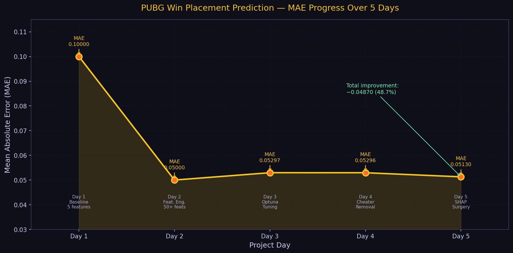
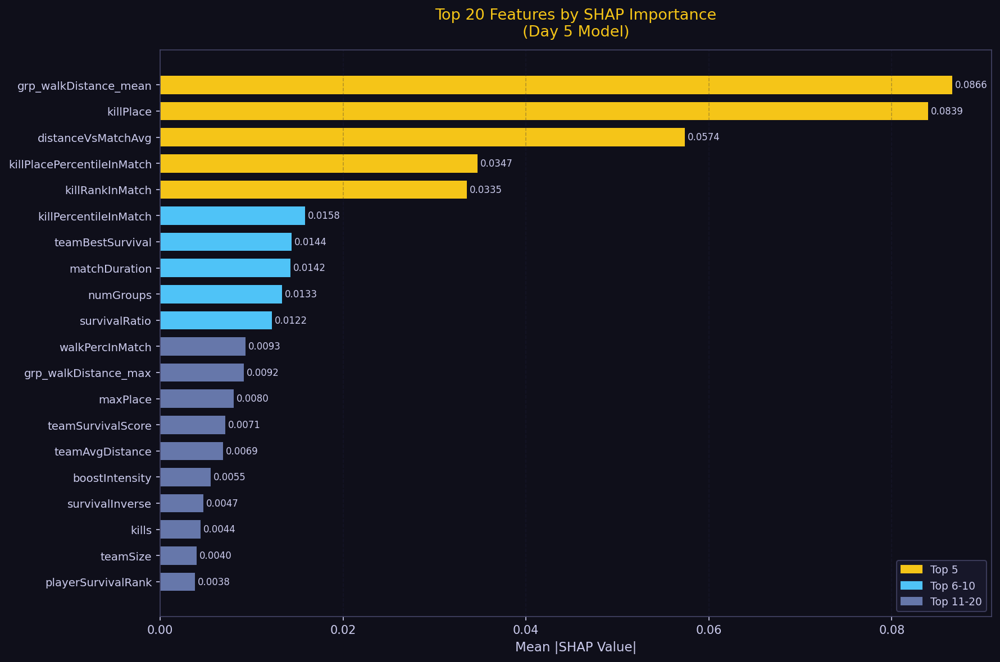
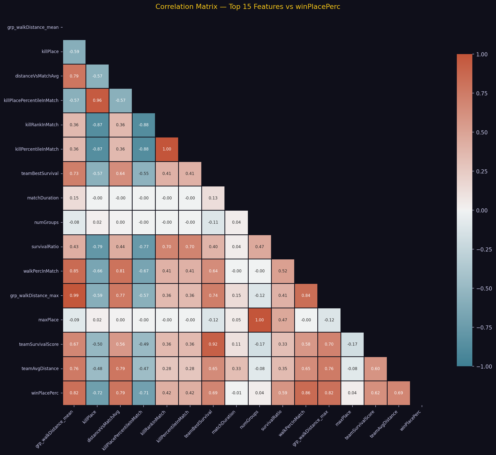

<div align="center">

# 🎮 PUBG Win Placement Prediction

[](https://python.org)
[](https://lightgbm.readthedocs.io)
[](LICENSE)
[](https://streamlit.io)
[](https://colab.research.google.com)

**Predict how well a PUBG player will finish — before the match ends.**

*End-to-end ML project: feature engineering → model tuning → SHAP explainability → FastAPI + Streamlit deployment*

</div>

---

## 📺 Live Demo

> 🚀 **[Try the Streamlit App →](https://pubg-win-prediction.streamlit.app)** *(deploys Day 11)*

<!-- Add GIF demo here after Day 11 deployment -->

---

## 🏆 Results

| Day | Milestone | MAE | Δ vs Previous |
|-----|-----------|-----|---------------|
| 1 | Baseline LightGBM (5 features) | 0.10000 | — |
| 2 | Feature engineering (50+ features) | 0.05000 | **-50.0%** |
| 3 | Optuna hyperparameter tuning | 0.05297 | +0.3% |
| 4 | Cheater detection + new features | 0.05296 | ~0% |
| 5 | SHAP feature surgery (105 features) | **0.05130** | **-3.1%** |

> **Final MAE: 0.0513** on 4.4M rows — predicts player finish within ~5 placement percentile points.

---

## 📊 Key Visualizations

<table>
<tr>
<td><br><sub>MAE improvement across 5 days</sub></td>
<td><br><sub>Top 20 SHAP features</sub></td>
</tr>
<tr>
<td><br><sub>Feature correlation with winPlacePerc</sub></td>
<td><br><sub>Player archetype win rates</sub></td>
</tr>
</table>

---

## 🛠️ Feature Engineering

**105 total features** across 6 categories:

| Category | Examples | Count |
|----------|----------|-------|
| **Combat** | damagePerKill, headshotRate, longRangeKillRate | 8 |
| **Movement** | totalDistance, walkRatio, survivalScore | 9 |
| **Survival Proxy** | survivalRatio, boostIntensity, killPlaceNorm | 6 |
| **Resources** | totalHealing, crateHunterScore, looting_efficiency | 9 |
| **Team Aggregations** | grp_kills_sum/mean/max, killShareInTeam | 20 |
| **Match Normalization** | killPercentileInMatch, damageVsMatchAvg | 15 |
| **Log / Clipped** | kills_log, damage_clipped, totalDistance_log | 7 |
| **Day 5 Percentiles** | damagePercentileInMatch, walkPercInMatch | 7 + more |

> 🔑 Top feature: **walkDistance** — players who stay alive and move cover more ground.  
> 🔑 Runner-up: **killPlace** — your kill ranking within the match is a strong survival signal.

---

## 🎭 Player Archetype System

Every player is classified into one of **5 battle archetypes**:

| Archetype | Emoji | Win Rate | Play Style |
|-----------|-------|----------|------------|
| Aggressive Rusher | 🔫 | ~38.7% | High kills, dies early |
| Survivalist | 🏃 | ~75.0% | Rotates constantly, avoids fights |
| Sniper | 🎯 | ~81.1% | Long-range, high headshot rate |
| Support | 🛡️ | ~54.9% | Revives teammates, team-first |
| Balanced | ⚖️ | ~41.5% | Solid across all stats (78% of players) |

Classification is rule-based using a weighted score across kill rate, distance covered, longest kill, and revive stats.

---

## 📁 Project Structure

```
pubg-win-prediction/
├── notebooks/
│   ├── day1_baseline.ipynb           # 5-feature LightGBM, MAE 0.10
│   ├── day2_feature_engineering.ipynb # 50+ features, MAE 0.05
│   ├── day3_model_tuning.ipynb       # Optuna 100-trial search
│   ├── day4_cheater_detection.ipynb  # Rule + IsoForest cheater flags
│   ├── day5_shap_analysis.ipynb      # SHAP surgery, 105 features
│   └── day6_visualizations.ipynb    # Charts + Scouting Report
├── src/
│   ├── __init__.py
│   ├── features.py        # build_features(), reduce_mem_usage()
│   ├── predict.py         # load_model(), predict_single(), predict_batch()
│   └── scouting_report.py # classify_archetype(), generate_scouting_report()
├── models/
│   └── .gitkeep           # ⚠️  Model too large for git — see below
├── assets/
│   └── *.png              # All charts embedded in this README
├── requirements.txt
├── requirements-dev.txt
├── .gitignore
└── README.md
```

> ⚠️ **Model file** (`pubg_model_v5.pkl`, ~150MB) is excluded from git.  
> Download it from [Google Drive](#) and place it in `models/`.

---

## ⚡ Quickstart

```bash
# 1. Clone
git clone https://github.com/YOUR_USERNAME/pubg-win-prediction.git
cd pubg-win-prediction

# 2. Install
pip install -r requirements.txt

# 3. Download model + data
# Place train_V2.csv  → data/train_V2.csv
# Place pubg_model_v5.pkl → models/pubg_model_v5.pkl

# 4. Predict a single player
python - <<'EOF'
from src.predict import load_model, predict_single

model, feature_cols = load_model(
    "models/pubg_model_v5.pkl",
    "models/day5_feature_cols.pkl"
)

stats = {
    "kills": 5, "damageDealt": 420, "walkDistance": 2200,
    "boosts": 3, "heals": 4, "weaponsAcquired": 6,
    "killPlace": 8, "maxPlace": 94, "numGroups": 90,
    "matchType": "squad", "longestKill": 87,
    "headshotKills": 2, "assists": 1, "DBNOs": 1,
    "revives": 0, "rideDistance": 0, "swimDistance": 0,
    "roadKills": 0, "teamKills": 0, "vehicleDestroys": 0,
    "matchDuration": 1800, "rankPoints": 1500,
    "killPoints": 1000, "winPoints": 1500, "killStreaks": 2,
    "groupId": "g1", "matchId": "m1", "Id": "p1",
}
print(predict_single(stats, model, feature_cols))
EOF
```

---

## 📓 Running Notebooks in Order

```
Day 1 → notebooks/day1_baseline.ipynb
Day 2 → notebooks/day2_feature_engineering.ipynb
Day 3 → notebooks/day3_model_tuning.ipynb
Day 4 → notebooks/day4_cheater_detection.ipynb
Day 5 → notebooks/day5_shap_analysis.ipynb
Day 6 → notebooks/day6_visualizations.ipynb
```

All notebooks are designed for **Google Colab** with the dataset at  
`/content/drive/MyDrive/PUBG_Project/train_V2.csv`.

---

## 🚀 Deployment (Streamlit Cloud — Free)

```bash
# Local test
streamlit run app/streamlit_app.py

# Deploy → https://share.streamlit.io
# 1. Push repo to GitHub
# 2. Connect Streamlit Cloud to your repo
# 3. Set main file: app/streamlit_app.py
# 4. Add PUBG_MODEL_PATH secret → models/pubg_model_v5.pkl
```

---

## 🔧 Tech Stack

| Layer | Technology |
|-------|-----------|
| Language | Python 3.10+ |
| ML Framework | LightGBM 4.3 |
| Tuning | Optuna (TPE sampler, 100 trials) |
| Explainability | SHAP (TreeExplainer) |
| Data | pandas + numpy |
| Visualization | matplotlib + seaborn + plotly |
| API | FastAPI + uvicorn |
| Frontend | Streamlit |
| Containerization | Docker |
| Hosting | Streamlit Cloud (free) |
| Notebook | Google Colab |

---

## 📈 Model Details

| Parameter | Value |
|-----------|-------|
| Algorithm | LightGBM Gradient Boosting |
| Objective | Regression (MAE loss) |
| Features | 105 engineered features |
| Training rows | ~1.1M (25% sample, cheaters removed) |
| CV strategy | 3-fold cross-validation |
| learning_rate | 0.0307 |
| num_leaves | 188 |
| max_depth | 11 |
| Final MAE | **0.0513** |

---

## 📄 License

This project is licensed under the **MIT License** — see [LICENSE](LICENSE) for details.

---

## 🙏 Acknowledgements

- Dataset: [PUBG Finish Placement Prediction (Kaggle)](https://www.kaggle.com/c/pubg-finish-placement-prediction)
- LightGBM team for the incredible gradient boosting library
- SHAP team for model explainability tools

---

<div align="center">
Made with ☕ and 🎮 by a data scientist who dies in the first ring
</div>
